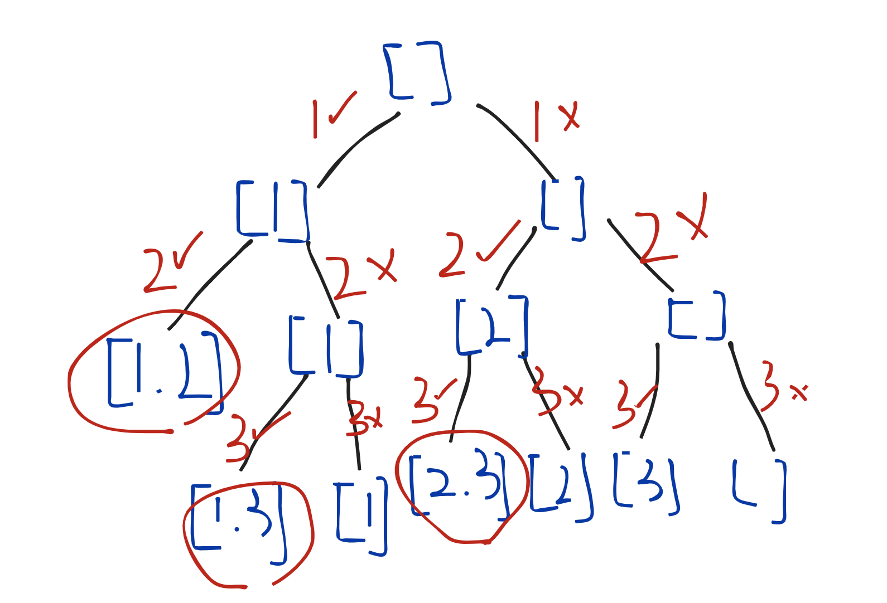

# 第三周总结
## 递归的场景 
二叉树，前中后序号

## 递归分类

- 泛型
- 分治 把大问题变成小问题
- 回溯 先假设可以，不行就回溯

这一章节感觉是最难的一节，递归很多的解法都不是一下子能想到的，

（泛型）括号生成
（分治）从前序与中序遍历序列构造二叉树
（回溯）五毒神掌

先按老师的思路，写出递归模版
```js
function recursion(level, param1, ...) {
    // recursion terminator 终结
    if(level > Max_LEVEL) 
        // process_result
        return ;
    
    // process current logic 处理当前逻辑
    process(level, param);    

    // drill down 向下展开
    recur(level: level + 1);

    // restore current status
}
```

然后看题分析
如果是二叉树：
可以从 前中后序 入手
递归的 另一种解法就是 迭代

再难一些的就是 分治与回溯

分治 把大问题变成小问题
回溯 先假设可以，不行就回溯

可能一下子不能像出来，只能去使用五毒神掌去练习，递归是很高频且不容易想到的问题，后面得回过头来认真复习

## 助教对回溯的看法与理解  英文：backtrack

我看有很多同学感觉回溯比较吃力，我来简单说一下，回溯特别简单！一定要理解，回溯的本质是：

【有很多步选择要做，我们不知道每步选择应该选啥，所以，我们先随便选一个，然后前往下一步，继续做选择；当我们走到某个位置，发现无路可走时，我们就往回退（return），退到上一步，重新做选择】

大家可以思考一下走迷宫，走迷宫就是最好的回溯的例子！我们会遇到很多十字路口（要选择方向），然而我们并不知道应该往哪个方向走（并不知道要选哪个方向），那么，我们先随便选一个，走下去；如果遇到死胡同，就往回退；

我们做的实际上就是在这棵树上进行DFS；

注意，回溯就是DFS，没有区别，没有区别，没有区别；回溯本质不是分治，也不是递归（递归是一种实现手段）

我们可以发现，每步做的选择组合在一起，会变成一颗树；



以咱们做过的例题【组合】为例，对于n个数字中的每个，我们【要么选，要么不选】，这就是我们要做的选择，所有选择的最终的组合长成这个样子

只要想明白：我们要做什么选择，每步选择有多少种可能，我们就能清晰地画出解答树，所有回溯的题目都能迎刃而解

有很多步选择要做 ➡️ 不同选择组合在一起构成解答树 ➡️ 在解答树上使用递归DFS，遍历所有组合 ➡️ 回溯

强烈不建议硬记譬如“什么算法就是什么”这一类的概念哈，算法的本质是清晰的解决问题的步骤，只有理解了某类问题要用什么思路去解决，才能掌握算法哈～