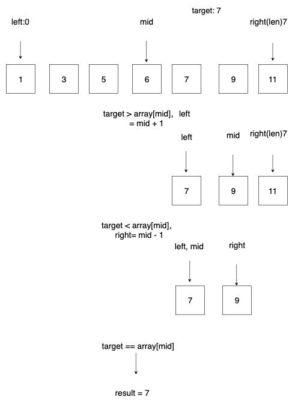

# 对于DFS 与 BFS 理解

DFS 
- 递归 不停往左子树，再往右子树递归
- 迭代 使用栈
BFS, 不停往下一层扩散, 每次都递归一层
迭代法 使用队列

# 二分查找
我的理解：
暴力破解是遍历每一个节点，每个节点被访问了一次，所以时间复杂度为 O(N)，

二分：
每次取中间值，然后可以分为 left_area，right_are，与目标target进行比较，每次查找都可以省去一半的搜索范围（省去一半的时间与访问次数），所以时间复杂度为 O(logN);

