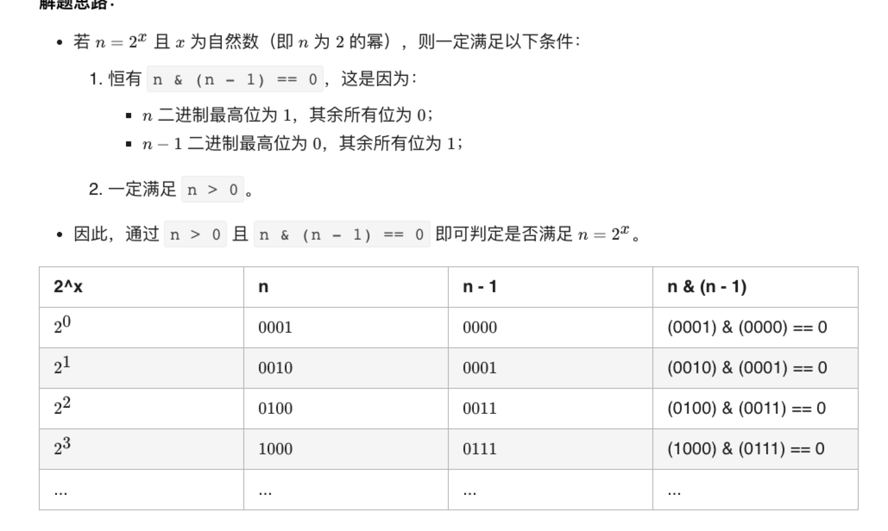

# 总结

## 位运算技巧


判断奇偶
(x & 1) == 1 ---等价---> (x % 2 == 1)
(x & 1) == 0 ---等价---> (x % 2 == 0)
x / 2 ---等价---> x >> 1
x &= (x - 1) ------> 把x最低位的二进制1给去掉
x & -x -----> 得到最低位的1
x & ~x -----> 0
 

[leetcode官方位运算技巧](https://leetcode-cn.com/problems/power-of-two/solution/2de-mi-by-leetcode-solution-rny3/#comment)

[5种解法，你应该背下的位操作知识](
https://leetcode-cn.com/problems/power-of-two/solution/5chong-jie-fa-ni-ying-gai-bei-xia-de-wei-6x9m/)
图解



 N皇后模版
 ```js
 var totalNQueens = function(n) {  
    let count = 0;  
    void (function dfs(row = 0, cols = 0, xy_diff = 0, xy_sum = 0) {
        if (row >= n) {      
            count++;     
            return;    
        }    
        // 皇后可以放的地方    
        let bits = ~(cols | xy_diff | xy_sum) & ((1 << n) - 1);    
        while (bits) {      
            // 保留最低位的 1      
            let p = bits & -bits;   
            // 把x最低位的二进制1给去掉   
            bits &= bits - 1;      
            dfs(row + 1, cols | p, (xy_diff | p) << 1, (xy_sum | p) >> 1);    
        }  
    })();  
    return count;
};
 ```

 并查集模版
 ```js
 class unionFind {  
    constructor(n) {    
        this.count = n;    
        this.parent = new Array(n);    
        for (let i = 0; i < n; i++) {      
            this.parent[i] = i;    
            }
    }  
    find(p) {
        let root = p;    
        while (parent[root] !== root) {   
            root = parent[root];    
        }    // 压缩路径    
        while (parent[p] !== p) {      
            let x = p;      
            p = this.parent[p];      
            this.parent[x] = root;    
        }    
        return root;  
    }  
    union(p, q) {    
        let rootP = find(p);    
        let rootQ = find(q);    
        if (rootP === rootQ) return;    
        this.parent[rootP] = rootQ;    
        this.count--;  
        }
    }
 }   
 ```